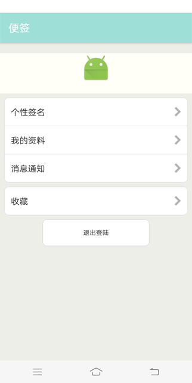

# Software-Engereering
> Author: wlj

> E-mail: 1322912751@qq.com

> Date: 2019-1-20

>Description:软件应用实践课设

## 结果展示

### 登陆页面

###注册页面

### 菜单页面

####菜单动画效果

### 功能页面展示
####写便签功能

####查看便签功能


### MarkDown功能


###日历功能


###写字板功能


###设置功能


## 核心技术

### 便签功能
基于小米便签实现等功能，在其基础上增加了菜单按钮等功能
### MarkDown
* 获取页面内容进行语法分析
* 增加数据库，实现数据与数据库交互功能
* 支持文本写入本地

### 写字板功能
* 获取touch到像素点，对于其进行保存
###日历功能
* 依赖第三方库的实现


## 不足
本课设实现总体要求，但是存在以下不足：

* markdown与便签数据库分离
* 登录注册功能没有添加数据库

## 代码结构
```
app/src/main
│
├── java/com/net/micode/notes
│   ├── calender #日历功能
│   ├── menu#菜单页面
|   |—— jnote#markdown功能
|   |——login#登录功能
|   |——draw#写字板功能
|   |——me#设置功能
|   |——menubutton#时间轴查看按钮
│   └── 小米便签部分——data
|                 |——gtask
|                 |——UI
|                 |——widget
|                 |——tool
|                 |__model
|
│ 
├──  res # 存放资源文件
│
└── AndroidManifest.xml # 配置文件
```

## 测试环境

* 代码环境：Android-studio 
* 真机环境：vivo
* API 版本: 26 Android 8.0